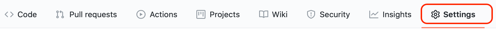
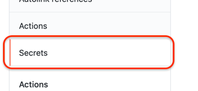
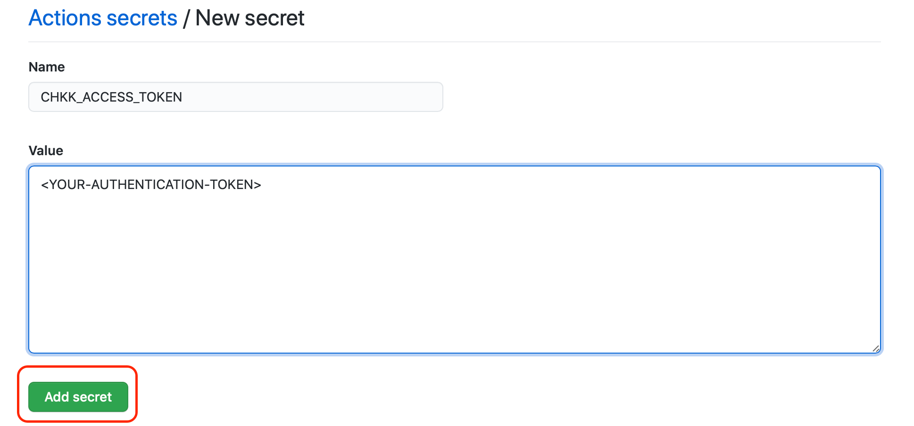

# Chkk Kubernetes Action

Integrating with Github Actions is as simple as downloading Chkk and running a scan on your Kubernetes manifests to catch reliability risks in your deployments and upgrades.

Here's an example of using Chkk K8s Action, in this case to run checks on a sample Helm chart `ingress-nginx`:


```yaml
name: CI
on:
  push:
jobs:
  deployment:
    runs-on: 'ubuntu-latest'
    steps:
      - uses: actions/checkout@v1

      - uses: chkk-io/actions/k8s@main
        id: precheck
        env:
          CHKK_ACCESS_TOKEN: ${{ secrets.CHKK_ACCESS_TOKEN }}
        with:
          continue-on-failure: false

      - name: Deploy
        uses: WyriHaximus/github-action-helm3@v2.1.3
        with:
          exec: |
            apk --no-cache add curl
            curl -o aws-iam-authenticator https://amazon-eks.s3.us-west-2.amazonaws.com/1.21.2/2021-07-05/bin/linux/amd64/aws-iam-authenticator
            chmod +x ./aws-iam-authenticator
            mkdir -p $HOME/bin && cp ./aws-iam-authenticator $HOME/bin/aws-iam-authenticator && export PATH=$PATH:$HOME/bin
            echo 'export PATH=$PATH:$HOME/bin' >> ~/.bashrc
            helm repo add ingress-nginx https://kubernetes.github.io/ingress-nginx;helm repo update; helm install demo-nginx ingress-nginx/ingress-nginx --atomic --version 3.35.0 --post-renderer ./chkk-post-renderer
          kubeconfig: '${{ secrets.KUBECONFIG }}'
        env:
          AWS_ACCESS_KEY_ID: ${{ secrets.AWS_ACCESS_KEY_ID }}
          AWS_SECRET_ACCESS_KEY: ${{ secrets.AWS_SECRET_ACCESS_KEY }}
          AWS_SESSION_TOKEN: ${{ secrets.AWS_SESSION_TOKEN }}

```


The Chkk GitHub Action has properties which are passed to the underlying chkk API. These are passed to the action using `with`.

| Parameter           | Default | Description                                                  |
| :------------------ | :------ | ------------------------------------------------------------ |
| checklists          |  []     | List of checks to run              |
| suppressions        |  []     | List of checks to suppress |
| filters        |   [Secret.data,Secret.data.*]      | List of filters to apply on Kubernetes manifest           |
| continue-on-failure       |    false     | Do not raise error in case a check fails |
| chkk-config-path          | ${{ github.workspace }}/.chkk | Path to custom chkk configuration file |
| chkk-config-file | config.yaml | Name of custom chkk configuration file |


## Setup Access Token in GitHub repository secrets

1. Go to the `Settings` tab in your repository menu.



2. From the side menu, select `Secrets`.



3. Add your Chkk access token as a secret, as shown below.



## Examples

### Run All Available Checks
To run all available checks, configure the Action with default parameters.

```yaml
name: CI
on:
  push:
jobs:
  deployment:
    runs-on: 'ubuntu-latest'
    steps:
      - uses: actions/checkout@v1

      - uses: chkk-io/actions/k8s@main
        id: precheck
        env:
          CHKK_ACCESS_TOKEN: ${{ secrets.CHKK_ACCESS_TOKEN }}

      - name: Deploy
        uses: WyriHaximus/github-action-helm3@v2.1.3
        with:
          exec: |
            apk --no-cache add curl
            curl -o aws-iam-authenticator https://amazon-eks.s3.us-west-2.amazonaws.com/1.21.2/2021-07-05/bin/linux/amd64/aws-iam-authenticator
            chmod +x ./aws-iam-authenticator
            mkdir -p $HOME/bin && cp ./aws-iam-authenticator $HOME/bin/aws-iam-authenticator && export PATH=$PATH:$HOME/bin
            echo 'export PATH=$PATH:$HOME/bin' >> ~/.bashrc
            helm repo add ingress-nginx https://kubernetes.github.io/ingress-nginx;helm repo update; helm install demo-nginx ingress-nginx/ingress-nginx --atomic --version 3.35.0 --post-renderer ./chkk-post-renderer
          kubeconfig: '${{ secrets.KUBECONFIG }}'
        env:
          AWS_ACCESS_KEY_ID: ${{ secrets.AWS_ACCESS_KEY_ID }}
          AWS_SECRET_ACCESS_KEY: ${{ secrets.AWS_SECRET_ACCESS_KEY }}
          AWS_SESSION_TOKEN: ${{ secrets.AWS_SESSION_TOKEN }}
```

### Run Specific CRRs

To run one or more specific checks on the sample Helm chart, configure the Action with following parameter:

`checklists` : <list of comma separated checklist IDs. e.g. chkls_200bff0f-ddca-43e0-ba11-9d387dfa0410,chkls_8u8bfer2-ddca-43e0-c2t-9d674d3fa0mn98>

```yaml
name: CI
on:
  push:
jobs:
  deployment:
    runs-on: 'ubuntu-latest'
    steps:
      - uses: actions/checkout@v1

      - uses: chkk-io/actions/k8s@main
        id: precheck
        env:
          CHKK_ACCESS_TOKEN: ${{ secrets.CHKK_ACCESS_TOKEN }}
        with:
          checklists: "chkls_200bff0f-ddca-43e0-ba11-9d387dfa0410,chkls_8u8bfer2-ddca-43e0-c2t-9d674d3fa0mn98"

      - name: Deploy
        uses: WyriHaximus/github-action-helm3@v2.1.3
        with:
          exec: |
            apk --no-cache add curl
            curl -o aws-iam-authenticator https://amazon-eks.s3.us-west-2.amazonaws.com/1.21.2/2021-07-05/bin/linux/amd64/aws-iam-authenticator
            chmod +x ./aws-iam-authenticator
            mkdir -p $HOME/bin && cp ./aws-iam-authenticator $HOME/bin/aws-iam-authenticator && export PATH=$PATH:$HOME/bin
            echo 'export PATH=$PATH:$HOME/bin' >> ~/.bashrc
            helm repo add ingress-nginx https://kubernetes.github.io/ingress-nginx;helm repo update; helm install demo-nginx ingress-nginx/ingress-nginx --atomic --version 3.35.0 --post-renderer ./chkk-post-renderer
          kubeconfig: '${{ secrets.KUBECONFIG }}'
        env:
          AWS_ACCESS_KEY_ID: ${{ secrets.AWS_ACCESS_KEY_ID }}
          AWS_SECRET_ACCESS_KEY: ${{ secrets.AWS_SECRET_ACCESS_KEY }}
          AWS_SESSION_TOKEN: ${{ secrets.AWS_SESSION_TOKEN }}
```

### Suppress CRRs

To suppress one or more specific checks, configure the Action with following parameter:

`suppressions` : <list of comma separated suppression IDs. e.g. sup_200bff0f-ddca-43e0-ba11-9d387dfa0410,sup_8u8bfer2-ddca-43e0-c2t-9d674d3fa0mn98>

```yaml
name: CI
on:
  push:
jobs:
  deployment:
    runs-on: 'ubuntu-latest'
    steps:
      - uses: actions/checkout@v1

      - uses: chkk-io/actions/k8s@main
        id: precheck
        env:
          CHKK_ACCESS_TOKEN: ${{ secrets.CHKK_ACCESS_TOKEN }}
        with:
          suppressions: "sup_200bff0f-ddca-43e0-ba11-9d387dfa0410,sup_8u8bfer2-ddca-43e0-c2t-9d674d3fa0mn98"

      - name: Deploy
        uses: WyriHaximus/github-action-helm3@v2.1.3
        with:
          exec: |
            apk --no-cache add curl
            curl -o aws-iam-authenticator https://amazon-eks.s3.us-west-2.amazonaws.com/1.21.2/2021-07-05/bin/linux/amd64/aws-iam-authenticator
            chmod +x ./aws-iam-authenticator
            mkdir -p $HOME/bin && cp ./aws-iam-authenticator $HOME/bin/aws-iam-authenticator && export PATH=$PATH:$HOME/bin
            echo 'export PATH=$PATH:$HOME/bin' >> ~/.bashrc
            helm repo add ingress-nginx https://kubernetes.github.io/ingress-nginx;helm repo update; helm install demo-nginx ingress-nginx/ingress-nginx --atomic --version 3.35.0 --post-renderer ./chkk-post-renderer
          kubeconfig: '${{ secrets.KUBECONFIG }}'
        env:
          AWS_ACCESS_KEY_ID: ${{ secrets.AWS_ACCESS_KEY_ID }}
          AWS_SECRET_ACCESS_KEY: ${{ secrets.AWS_SECRET_ACCESS_KEY }}
          AWS_SESSION_TOKEN: ${{ secrets.AWS_SESSION_TOKEN }}
```


### Suppress Check Failures

To prevent the overall Action from failing in case one or more CRRs fail, configure the Action with following parameter `continue-on-failure` to be `true`

```yaml
name: CI
on:
  push:
jobs:
  deployment:
    runs-on: 'ubuntu-latest'
    steps:
      - uses: actions/checkout@v1

      - uses: chkk-io/actions/k8s@main
        id: precheck
        env:
          CHKK_ACCESS_TOKEN: ${{ secrets.CHKK_ACCESS_TOKEN }}
        with:
          continue-on-failure: true

      - name: Deploy
        uses: WyriHaximus/github-action-helm3@v2.1.3
        with:
          exec: |
            apk --no-cache add curl
            curl -o aws-iam-authenticator https://amazon-eks.s3.us-west-2.amazonaws.com/1.21.2/2021-07-05/bin/linux/amd64/aws-iam-authenticator
            chmod +x ./aws-iam-authenticator
            mkdir -p $HOME/bin && cp ./aws-iam-authenticator $HOME/bin/aws-iam-authenticator && export PATH=$PATH:$HOME/bin
            echo 'export PATH=$PATH:$HOME/bin' >> ~/.bashrc
            helm repo add ingress-nginx https://kubernetes.github.io/ingress-nginx;helm repo update; helm install demo-nginx ingress-nginx/ingress-nginx --atomic --version 3.35.0 --post-renderer ./chkk-post-renderer
          kubeconfig: '${{ secrets.KUBECONFIG }}'
        env:
          AWS_ACCESS_KEY_ID: ${{ secrets.AWS_ACCESS_KEY_ID }}
          AWS_SECRET_ACCESS_KEY: ${{ secrets.AWS_SECRET_ACCESS_KEY }}
          AWS_SESSION_TOKEN: ${{ secrets.AWS_SESSION_TOKEN }}
```

### Filter confidential and private data from Kubernetes manifests

To filter out confidential data like Secrets from your Kubernetes manifests, configure the Action with the following parameter:

`filters` : <list of comma separated filters. e.g. ClusterRole.*,ServiceAccount.metadata.*>

```yaml
name: CI
on:
  push:
jobs:
  deployment:
    runs-on: 'ubuntu-latest'
    steps:
      - uses: actions/checkout@v1

      - uses: chkk-io/actions/k8s@main
        id: precheck
        env:
          CHKK_ACCESS_TOKEN: ${{ secrets.CHKK_ACCESS_TOKEN }}
        with:
          filters: "ClusterRole.*,ServiceAccount.metadata.*"

      - name: Deploy
        uses: WyriHaximus/github-action-helm3@v2.1.3
        with:
          exec: |
            apk --no-cache add curl
            curl -o aws-iam-authenticator https://amazon-eks.s3.us-west-2.amazonaws.com/1.21.2/2021-07-05/bin/linux/amd64/aws-iam-authenticator
            chmod +x ./aws-iam-authenticator
            mkdir -p $HOME/bin && cp ./aws-iam-authenticator $HOME/bin/aws-iam-authenticator && export PATH=$PATH:$HOME/bin
            echo 'export PATH=$PATH:$HOME/bin' >> ~/.bashrc
            helm repo add ingress-nginx https://kubernetes.github.io/ingress-nginx;helm repo update; helm install demo-nginx ingress-nginx/ingress-nginx --atomic --version 3.35.0 --post-renderer ./chkk-post-renderer
          kubeconfig: '${{ secrets.KUBECONFIG }}'
        env:
          AWS_ACCESS_KEY_ID: ${{ secrets.AWS_ACCESS_KEY_ID }}
          AWS_SECRET_ACCESS_KEY: ${{ secrets.AWS_SECRET_ACCESS_KEY }}
          AWS_SESSION_TOKEN: ${{ secrets.AWS_SESSION_TOKEN }}
```

### Specify custom chkk configuration

To specify a custom configuration file for chkk that is located in your source code, configure the Action with the following parameters:

`use-custom-config` : true

`chkk-config-path`: ${{github.workspace}}/k8s/

`chkk-config-file`: config.yaml

```yaml
name: CI
on:
  push:
jobs:
  deployment:
    runs-on: 'ubuntu-latest'
    steps:
      - uses: actions/checkout@v1

      - uses: chkk-io/actions/k8s@main
        id: precheck
        env:
          CHKK_ACCESS_TOKEN: ${{ secrets.CHKK_ACCESS_TOKEN }}
        with:
          use-custom-config: true
          chkk-config-path: ${{github.workspace}}/k8s/
          chkk-config-file: config.yaml

      - name: Deploy
        uses: WyriHaximus/github-action-helm3@v2.1.3
        with:
          exec: |
            apk --no-cache add curl
            curl -o aws-iam-authenticator https://amazon-eks.s3.us-west-2.amazonaws.com/1.21.2/2021-07-05/bin/linux/amd64/aws-iam-authenticator
            chmod +x ./aws-iam-authenticator
            mkdir -p $HOME/bin && cp ./aws-iam-authenticator $HOME/bin/aws-iam-authenticator && export PATH=$PATH:$HOME/bin
            echo 'export PATH=$PATH:$HOME/bin' >> ~/.bashrc
            helm repo add ingress-nginx https://kubernetes.github.io/ingress-nginx;helm repo update; helm install demo-nginx ingress-nginx/ingress-nginx --atomic --version 3.35.0 --post-renderer ./chkk-post-renderer
          kubeconfig: '${{ secrets.KUBECONFIG }}'
        env:
          AWS_ACCESS_KEY_ID: ${{ secrets.AWS_ACCESS_KEY_ID }}
          AWS_SECRET_ACCESS_KEY: ${{ secrets.AWS_SECRET_ACCESS_KEY }}
          AWS_SESSION_TOKEN: ${{ secrets.AWS_SESSION_TOKEN }}
```

Made with 🧡 by Chkk